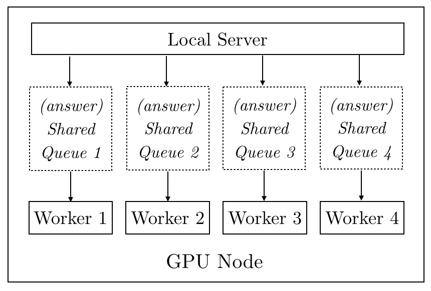

# Leader Stochastic Gradient Descent
This is the code repository for paper [*Leader Stochastic Gradient Descent for Distributed
Training of Deep Learning Models*](https://arxiv.org/abs/1905.10395).

A Blog which carefully described the algorithm could be found at [**[LSGD Blog]**](https://yunfei-teng.github.io/LSGD-Blog/).

## Requirements
PyTorch from [official website](https://pytorch.org). This is one of the most popular deep learning tools.

## Instruction
1. On the first GPU node, use command ```ifconfig``` in terminal to check its IP address;

2. Open the bash file ```train.sh```: fill in *ip_addr* with the IP address you obtained from step 1 and *num_groups* with the total number of GPU nodes you have (i.e. *num_groups=n*);

3. On *j*-th GPU note, in terminal type ```bash train.sh [j-1]``` (i.e. index starts from 0) to run the codes.

## Possible Issues
1. Type ```nvidia-smi``` in terminal to check nvidia driver and [cuda compatibility](https://docs.nvidia.com/deploy/cuda-compatibility);

2. Check consistency of PyTorch versions across the machines.

## Architecture
This page is mainly used for explaining the distributed training library of LSGD I developed.

The general architecture is the following:


At the beginning of each iteration, the local worker sends out a request to its local server and then the local server passes on the worker’s request to the global server. The global server checks the current status and replies to the local server. The local server passes on the global server’s message to the worker. Finally, depending on the message from the global server, the worker will choose to follow the local training or distributed training scheme.

More specifically, the communication between the local server and the workers is based on shared *queues*. For each worker, at the beginning of each iteration, it sends a requenst to local server and then waits for the answer.


The local server gets the answer from global server and puts the answer into the *queue* shared with the workers. Then the worker reads and follows the answer.


The advantage of using `queue` is that: (1) the number of request the local server paases on to the global server is always equal to the number of requests raised by workers (a shared tensor which stores the total number of requests from workers may induce inaccurate count as this number can be modified simutaneously by the workers) and (2) the worker waits until it gets the answer from the local server.

For each local server, the global server creates a thread for listening and responding to it. All the threads share a iteration counter which stores the total number of iterations of all workers after the last communication. Again, the data structure of iteration counter is a *queue* instead of a number or a single-value tensor as there is a chance that two or more threads can modify the value simutaneously. Althout due to *Global Interpreter Lock* the conflicts should not happen, in practice I found using *queue* is safer.


Each Node/Cluster/DevBox is usually provided with 4 GPUs (workers). We call all GPUs (workers) in the same Node/Cluster/DevBox as a group.

## Discussion

#### Hyperparameter Selection
For learning rates and pulling strengths, in a relatively reasonalble range, smaller values usually encourage lower final test error while larger values encourage faster convergence.

For communication period, this depends on the network condition. Our lab is using Ethernet which is usually slower than InfiniBand. The data transfer speed can be checked by netowrk tool `iperf`.

#### Batch Normaliztion
One dilemma for distributed training is to deal with running mean and running variance of [batch normalization](https://arxiv.org/abs/1502.03167). Based on our knowledge, there is no perfect solution to synchronize running mean and running variance especially for asynchronous communication so far. Usually, when synchronizing we can ignore running mean and running variance so that each model (worker) keeps their own statistics. In our implementation, we average both running mean and running variance of all workers for every commumication period (As a side note, for PyTorch 1.0 version, synchronizing the empty tensors will cause an error, so make sure to comment out the parts of synchronizing the buffers).

#### Feedback
The codes were developed when PyTorch first officially released its distributed training library (I believe it was roughly PyTorch 1.0 version). Since no refernce was available to me and I had to develope everything from scrath, there might be potential issues in the codes I haven't discovered yet due to the limitation of my knowledge. Feedbacks and questions are welcome!
